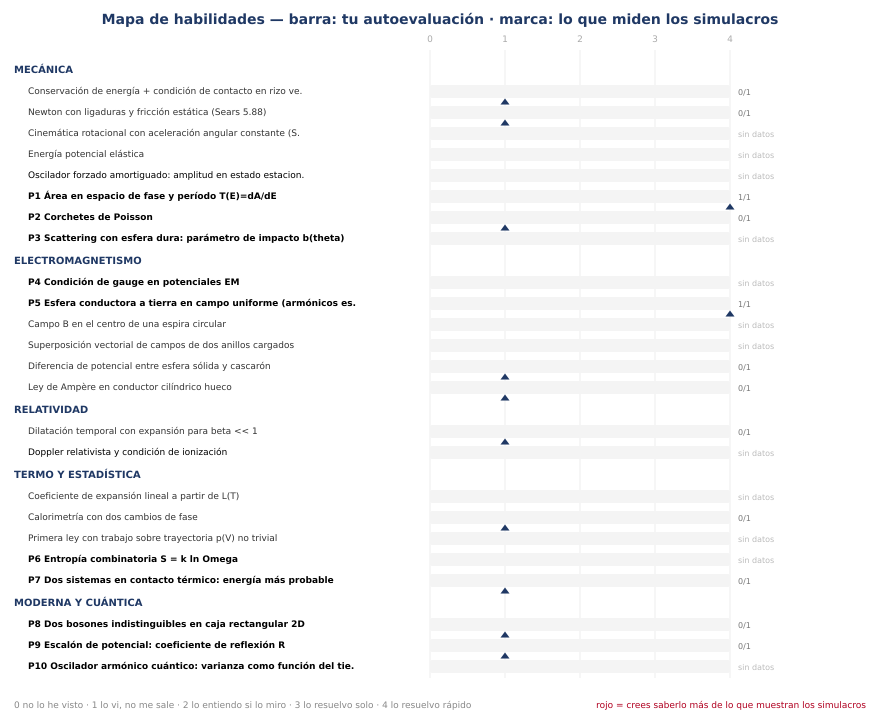
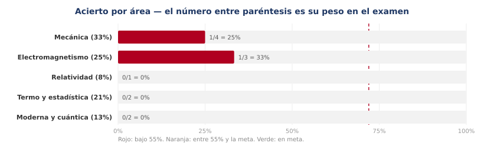
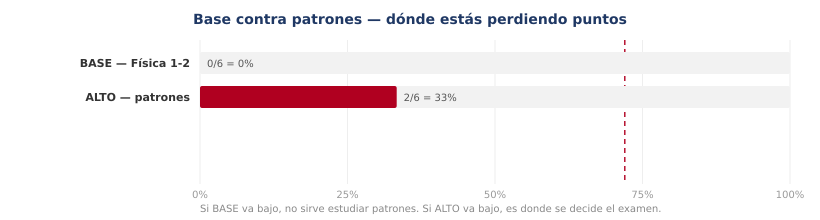
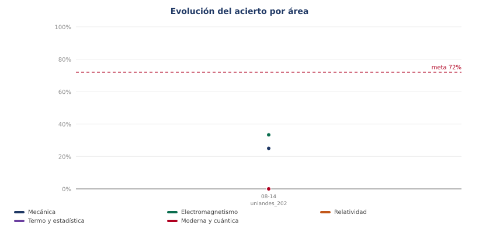
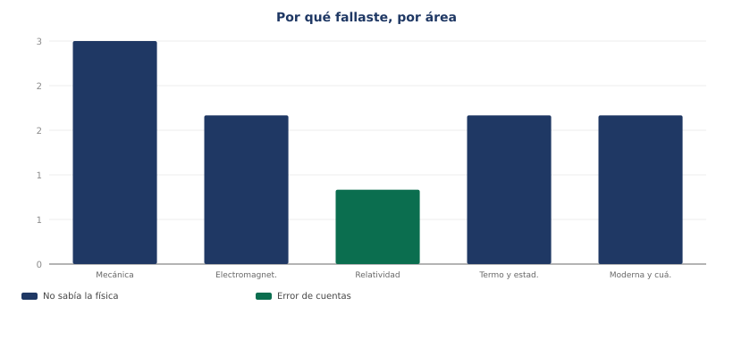
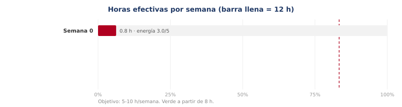
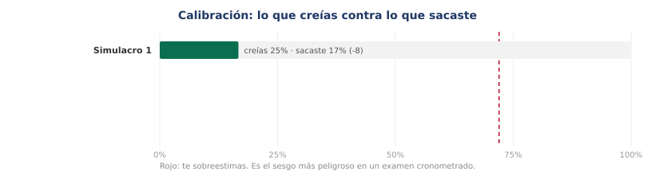

# Reporte de seguimiento

*Generado el 2026-08-15 — faltan **100 días** para el examen (23 de noviembre de 2026). Semana 1 de 14.*

> **Para Claude:** este archivo es el estado actual de la preparación. Léelo al inicio de la sesión para saber dónde está Sebastián sin volver a preguntar. Se regenera con `python3 06_SEGUIMIENTO/medidor.py reporte`.

---

## Resumen

- Simulacros registrados: **1**
- Preguntas respondidas: **12** — acierto global **16.7%** (meta 72%)
- Sesiones registradas: **1** — **0.8 h** en total
- Errores en bitácora: **0**

## Acierto por área

| Área | Peso | Aciertos | % | Estado |
|---|---|---|---|---|
| Mecánica | 33% | 1/4 | 25% | crítico |
| Electromagnetismo | 25% | 1/3 | 33% | crítico |
| Relatividad | 8% | 0/1 | 0% | crítico |
| Termo y estadística | 21% | 0/2 | 0% | crítico |
| Moderna y cuántica | 13% | 0/2 | 0% | crítico |

## Base contra patrones

| Nivel | Aciertos | % | Qué significa |
|---|---|---|---|
| BASE | 0/6 | 0% | Física 1-2. Es el 55% del examen: aquí se aprueba. |
| ALTO | 2/6 | 33% | Los 10 patrones. Es el 40%: aquí se decide. |

## Los 10 patrones

| Patrón | Intentos | Aciertos | Estado |
|---|---|---|---|
| P1 | 1 | 1 | dominado |
| P2 | 1 | 0 | PENDIENTE |
| P5 | 1 | 1 | dominado |
| P7 | 1 | 0 | PENDIENTE |
| P8 | 1 | 0 | PENDIENTE |
| P9 | 1 | 0 | PENDIENTE |

## Por qué fallas

| Causa | Veces | % |
|---|---|---|
| No sabía la física | 9 | 90% |
| Error de cuentas | 1 | 10% |

## Qué cambiar en el cronograma

- **Tu mayor bolsa de puntos es Mecánica**: va en 25% y pesa 33% del examen. Súmale las sesiones del domingo comodín hasta que suba.
- Después de esa, en orden de rentabilidad: Electromagnetismo (33%).
- **La base está floja (0%).** No sigas puliendo patrones: el 55% del examen es Física 1-2 y ahí se aprueba. Prioriza Sears y el banco HRW sobre Tong y Griffiths.
- **Predomina el vacío conceptual.** Es la buena noticia: se arregla estudiando, no con trucos. Sigue el cronograma sin saltarte teoría.
- Patrones aún fallados: **P2, P7, P8, P9**. Están en `03_TEMARIO/00_mapa_simulacro.md`. Cada uno vale ~4% del examen y se estudia en una sesión.

## Gráficas

*Ábrelas todas juntas en `tablero.html`.*
